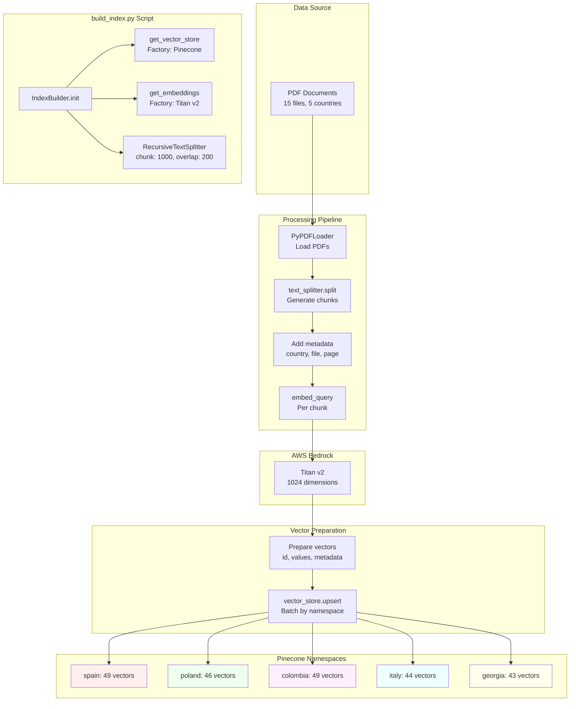
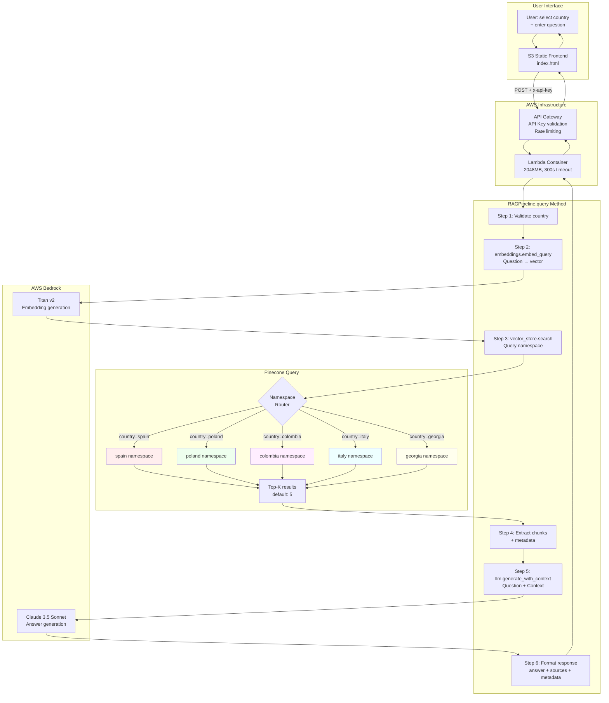

# RAG Powered AI Assistant

[](https://www.python.org/)
[](https://aws.amazon.com/lambda/)
[](https://www.pinecone.io/)
[](LICENSE)

Intelligent employment regulations assistant using RAG (Retrieval-Augmented Generation) architecture with namespace isolation to provide accurate, country-specific answers from a private knowledge base.

## Live Demo

**Frontend:** [https://rag-powered-ai-assistant-frontend.s3.eu-central-1.amazonaws.com/index.html](https://rag-powered-ai-assistant-frontend.s3.eu-central-1.amazonaws.com/index.html)

**API Endpoint:** `https://sycfgthg0g.execute-api.eu-central-1.amazonaws.com/prod/query`

Experience real-time RAG technology with namespace-isolated knowledge retrieval across 5 countries. API access requires authentication key (provided to evaluators separately).

---

## Problem Statement

Organizations operating across multiple countries face challenges accessing accurate, jurisdiction-specific employment regulations. Traditional documentation systems:
- Mix information from different countries
- Lack contextual understanding
- Require manual cross-referencing
- Cannot synthesize information from multiple sources

**Result:** Time-consuming research, potential compliance errors, and difficulty accessing accurate country-specific guidance.

---

## Solution

A serverless RAG system with **namespace isolation** that ensures zero cross-contamination between countries:

1. **Select Country** - Choose from 5 supported jurisdictions
2. **Ask Question** - Natural language queries about employment regulations
3. **Get Answer** - Contextual responses with source citations from the correct country
4. **Verify Sources** - Review document references with relevance scores

The system uses **Pinecone namespaces** to guarantee that queries to Spain only retrieve Spanish documents, Poland only Polish documents, etc.

---

## Architecture

The system consists of two distinct phases: **Index Building** (offline, one-time) and **Query Runtime** (online, per request).

### Phase 1: Index Building (Offline)



### Phase 2: Query Runtime (Online)



---

## Modular Architecture Explained

The system is built using a **3-layer factory pattern** that enables technology and cloud provider agnosticism.

### Architecture Layers

**1. Interface Layer** (`rag_core/interfaces/`)

Defines abstract contracts that any implementation must follow:
- `VectorStore` - Abstract base class for vector databases
- `Embeddings` - Abstract base class for embedding models
- `LLM` - Abstract base class for language models

These interfaces specify **what** operations are needed (e.g., `search()`, `embed_query()`, `generate()`) without dictating **how** they're implemented.

**2. Factory Layer** (`rag_core/factories/`)

Dynamically selects and instantiates concrete implementations based on configuration:
- `vector_store_factory.py` - Returns configured vector store
- `embeddings_factory.py` - Returns configured embedding model
- `llm_factory.py` - Returns configured LLM

Factories read from `settings.py`:
```python
VECTOR_STORE_TYPE = "pinecone"  # Could be "qdrant", "weaviate", etc.
EMBEDDINGS_TYPE = "bedrock"     # Could be "openai", "huggingface", etc.
LLM_TYPE = "bedrock"            # Could be "vllm", "anthropic", etc.
```

**3. Implementation Layer** (`rag_core/implementations/`)

Concrete providers that implement the abstract interfaces:
- `PineconeStore` - Implements `VectorStore` for Pinecone
- `BedrockEmbeddings` - Implements `Embeddings` for AWS Bedrock Titan
- `BedrockLLM` - Implements `LLM` for AWS Bedrock Claude

### How It Works

```python
# Application code (rag_pipeline.py, build_index.py)
from rag_core.factories import get_vector_store, get_embeddings, get_llm

# Factories return implementations based on config
vector_store = get_vector_store()  # Returns PineconeStore
embeddings = get_embeddings()      # Returns BedrockEmbeddings
llm = get_llm()                    # Returns BedrockLLM

# Application uses abstract interfaces, not concrete classes
results = vector_store.search(query_vector, namespace="spain")
answer = llm.generate_with_context(question, context)
```

The core RAG logic **never** imports `PineconeStore`, `BedrockEmbeddings`, or `BedrockLLM` directly. It only uses abstract interfaces.

### Why This Makes It Cloud-Agnostic

**Swapping Providers Requires Zero Code Changes:**

To switch from Pinecone to Qdrant:
1. Create `QdrantStore` class implementing `VectorStore` interface
2. Update `settings.py`: `VECTOR_STORE_TYPE = "qdrant"`
3. Done - No changes to `rag_pipeline.py` or any application code

To switch from Bedrock to OpenAI:
1. Create `OpenAIEmbeddings` and `OpenAILLM` classes
2. Update `settings.py`: `EMBEDDINGS_TYPE = "openai"`, `LLM_TYPE = "openai"`
3. Done - No changes to business logic

### Technology Agnostic

The same pattern works for any technology choice:
- **Vector DBs:** Pinecone → Qdrant → Weaviate → ChromaDB → Milvus
- **Embeddings:** Bedrock Titan → OpenAI → Cohere → HuggingFace
- **LLMs:** Bedrock Claude → OpenAI GPT → vLLM → Anthropic API

### Production Benefits

1. **No Vendor Lock-in:** Switch cloud providers without rewriting application logic
2. **Easy Testing:** Mock implementations for unit tests without external dependencies
3. **Gradual Migration:** Run multiple implementations simultaneously during migrations
4. **Cost Optimization:** Compare providers by swapping implementations with same data

This architecture is production-ready and used in enterprise systems where vendor flexibility and testability are critical.

---

## Technical Stack

| Component | Technology | Configuration |
|-----------|-----------|---------------|
| **Frontend** | S3 Static Website | HTML/CSS/JS, HTTPS enabled |
| **API** | API Gateway REST | CORS enabled, API key protected |
| **Compute** | Lambda Container Image | Python 3.12, 2048MB, 300s timeout |
| **Orchestration** | Custom RAG Core | Factory pattern, cloud-agnostic design |
| **Vector DB** | Pinecone Serverless | 1024 dims, cosine similarity, us-east-1 |
| **Embeddings** | Bedrock Titan v2 | amazon.titan-embed-text-v2:0 |
| **LLM** | Bedrock Claude 3.5 Sonnet | anthropic.claude-3-5-sonnet-20240620-v1:0 |
| **Monitoring** | CloudWatch Logs | Lambda execution logs |

---

## Key Features

### Namespace Isolation
**Critical requirement:** Zero cross-contamination between countries.
- Each country has its own Pinecone namespace
- Queries to Spain only search `spain` namespace
- **Test results:** 100% isolation verified across all countries

### Performance
- **Cold start:** 8-12s (Lambda container initialization, varies by load)
- **Warm start:** 2-4s (subsequent requests)
- **Vector search:** ~300ms (Pinecone serverless)
- **LLM generation:** ~2.1s (Claude 3.5 Sonnet)

### Accuracy
- Top-5 relevant chunks retrieved per query
- Cosine similarity scoring
- Source citations with page numbers and relevance scores
- Context-grounded answers (reduces hallucinations)

### Scalability
- Serverless architecture (auto-scaling)
- 231 vectors across 5 namespaces
- Supports thousands of concurrent queries
- No infrastructure management required

### Security
- AWS API Gateway key authentication
- Rate limiting: 200 requests/day per key
- Burst protection: 20 req/sec, sustained 10 req/sec
- CloudWatch monitoring and logging

---

## Supported Countries

| Country | Documents | Vector Count | Namespace |
|---------|-----------|--------------|-----------|
| Spain | 3 PDFs | 49 chunks | `spain` |
| Poland | 3 PDFs | 46 chunks | `poland` |
| Colombia | 3 PDFs | 49 chunks | `colombia` |
| Italy | 3 PDFs | 44 chunks | `italy` |
| Georgia | 3 PDFs | 43 chunks | `georgia` |

**Total:** 15 PDF documents, 231 indexed chunks

---

## Project Structure

```
RAG-powered_AI_assistant/
├── rag_core/                       # Cloud-agnostic modular architecture
│   ├── config/
│   │   └── settings.py            # Centralized configuration
│   ├── interfaces/                # Abstract contracts (swap components easily)
│   │   ├── vector_store.py        # Abstract VectorStore
│   │   ├── llm.py                 # Abstract LLM
│   │   └── embeddings.py          # Abstract Embeddings
│   ├── implementations/           # Concrete providers (Pinecone, Bedrock)
│   │   ├── vector_stores/
│   │   │   └── pinecone_store.py  # Pinecone implementation
│   │   ├── llms/
│   │   │   └── bedrock_llm.py     # Bedrock LLM implementation
│   │   └── embeddings/
│   │       └── bedrock_embeddings.py
│   ├── factories/                 # Component selection logic
│   │   ├── vector_store_factory.py
│   │   ├── llm_factory.py
│   │   └── embeddings_factory.py
│   └── core/
│       └── rag_pipeline.py        # Main RAG orchestration
├── lambda_function/
│   ├── app.py                     # Lambda handler
│   ├── Dockerfile                 # Container image
│   └── requirements.txt           # Lambda dependencies
├── scripts/
│   ├── build_index.py             # Index PDFs to Pinecone
│   └── deploy_frontend.sh         # Deploy frontend to S3
├── frontend/
│   └── index.html                 # Web interface
├── data/                          # PDF documents by country
│   ├── spain/
│   ├── poland/
│   ├── colombia/
│   ├── italy/
│   └── georgia/
├── test_results.md                # Comprehensive test report
├── requirements.txt               # Development dependencies
├── .env                           # Environment variables (not in repo)
├── .gitignore
├── LICENSE
└── README.md
```

---

## Installation & Deployment

### Prerequisites

- AWS Account with Bedrock access in `eu-central-1`
- Pinecone account (free tier)
- Python 3.12+
- Docker Desktop (for Lambda container)
- AWS CLI configured

### 1. Clone Repository

```bash
git clone https://github.com/AndresFMC/RAG-powered_AI_assistant.git
cd RAG-powered_AI_assistant
```

### 2. Set Up Python Environment

```bash
python3.12 -m venv venv
source venv/bin/activate  # Windows: venv\Scripts\activate
pip install -r requirements.txt
```

### 3. Configure Environment Variables

Create `.env` file:
```bash
# Pinecone Configuration
PINECONE_API_KEY=your_pinecone_api_key
PINECONE_INDEX_NAME=rag-powered-ai-assistant

# AWS Configuration (auto-detected by Lambda)
AWS_REGION=eu-central-1

# Bedrock Models
BEDROCK_EMBEDDING_MODEL=amazon.titan-embed-text-v2:0
BEDROCK_LLM_MODEL=anthropic.claude-3-5-sonnet-20240620-v1:0

# Component Selection
VECTOR_STORE_TYPE=pinecone
EMBEDDINGS_TYPE=bedrock
LLM_TYPE=bedrock

# RAG Configuration
CHUNK_SIZE=1000
CHUNK_OVERLAP=200
TOP_K_RESULTS=5
```

### 4. Create Pinecone Index

Via Pinecone Console:
- **Name:** `rag-powered-ai-assistant`
- **Dimension:** 1024 (Titan v2)
- **Metric:** cosine
- **Cloud:** AWS
- **Region:** us-east-1 (free tier)

### 5. Index Documents to Pinecone

```bash
# Ensure PDFs are in data/{country}/ directories
python scripts/build_index.py
```

**Output:** 231 vectors indexed across 5 namespaces (~2-3 minutes)

### 6. Build and Deploy Lambda Container

```bash
# Build Docker image (M1 Mac: use --platform linux/amd64)
docker build --platform linux/amd64 \
  -f lambda_function/Dockerfile \
  -t rag-powered-ai-assistant:latest .

# Authenticate to ECR
aws ecr get-login-password --region eu-central-1 | \
  docker login --username AWS --password-stdin \
  {ACCOUNT_ID}.dkr.ecr.eu-central-1.amazonaws.com

# Tag and push
docker tag rag-powered-ai-assistant:latest \
  {ACCOUNT_ID}.dkr.ecr.eu-central-1.amazonaws.com/rag-powered-ai-assistant:latest
docker push {ACCOUNT_ID}.dkr.ecr.eu-central-1.amazonaws.com/rag-powered-ai-assistant:latest

# Create Lambda function
aws lambda create-function \
  --function-name rag-powered-ai-assistant \
  --package-type Image \
  --code ImageUri={ACCOUNT_ID}.dkr.ecr.eu-central-1.amazonaws.com/rag-powered-ai-assistant:latest \
  --role {LAMBDA_ROLE_ARN} \
  --environment Variables="{PINECONE_API_KEY=...,PINECONE_INDEX_NAME=...}" \
  --timeout 300 \
  --memory-size 2048 \
  --region eu-central-1
```

### 7. Create API Gateway with API Key Protection

```bash
# Create REST API
aws apigateway create-rest-api \
  --name "rag-powered-ai-assistant-api" \
  --region eu-central-1

# Create API Key
aws apigateway create-api-key \
  --name "rag-demo-key" \
  --enabled \
  --region eu-central-1

# Create Usage Plan with rate limits
aws apigateway create-usage-plan \
  --name "rag-demo-plan" \
  --throttle burstLimit=20,rateLimit=10 \
  --quota limit=200,period=DAY \
  --region eu-central-1

# Associate API key to usage plan and stage
# Configure resources, methods, integrations, and CORS
# See AWS documentation for complete API Gateway setup
```

**Note:** The API requires `x-api-key` header for all requests.

### 8. Deploy Frontend

```bash
# Update frontend/index.html with your API endpoint
# Deploy to S3
./scripts/deploy_frontend.sh
```

---

## Security & Authentication

The API is protected by **AWS API Gateway API Keys** with infrastructure-level rate limiting.

### Rate Limits

| Limit Type | Value |
|------------|-------|
| Requests per day | 200 |
| Burst rate | 20 req/sec |
| Sustained rate | 10 req/sec |

### Authentication Flow

1. User enters API key in frontend
2. Frontend includes key in `x-api-key` header
3. API Gateway validates key before routing to Lambda
4. Invalid/missing keys receive 403 Forbidden

### Why API Gateway Keys?

- **Infrastructure-level security** via AWS native services
- **Rate limiting** to prevent abuse and control costs
- **Key rotation** capability without code changes
- **Usage tracking** and monitoring via CloudWatch

### Production Considerations

For production deployments, consider:
- Backend proxy to hide keys from client
- OAuth 2.0 / JWT authentication
- Per-user quotas and throttling
- Key expiration policies

---

## API Usage

### Endpoint
```
POST https://sycfgthg0g.execute-api.eu-central-1.amazonaws.com/prod/query
```

**Authentication:** All requests require `x-api-key` header.

### Request Format

```json
{
  "country": "spain",
  "question": "What is the probation period in Spain?"
}
```

**Supported countries:** `spain`, `poland`, `colombia`, `italy`, `georgia`

### Response Format

```json
{
  "answer": "According to the context provided, the probation period in Spain varies depending on the employee's qualifications:\n\n1. For qualified technicians with a university degree: Up to 6 months.\n2. For all other employees: Up to 2 months...",
  "country": "spain",
  "sources": [
    {
      "file": "02_spain_labor_regulations.pdf",
      "score": 0.5056,
      "page": 2.0
    },
    {
      "file": "01_spain_general_hiring_guide.pdf",
      "score": 0.4298,
      "page": 2.0
    }
  ],
  "chunks_used": 5,
  "model": "anthropic.claude-3-5-sonnet-20240620-v1:0"
}
```

### Example with cURL

```bash
curl -X POST \
  "https://sycfgthg0g.execute-api.eu-central-1.amazonaws.com/prod/query" \
  -H "Content-Type: application/json" \
  -H "x-api-key: YOUR_API_KEY_HERE" \
  -d '{"country":"poland","question":"What are the mandatory vacation days?"}'
```

### Stats Endpoint

```bash
curl -X POST \
  "https://sycfgthg0g.execute-api.eu-central-1.amazonaws.com/prod/query" \
  -H "Content-Type: application/json" \
  -H "x-api-key: YOUR_API_KEY_HERE" \
  -d '{"action":"stats"}'
```

**Response:**
```json
{
  "total_vectors": 231,
  "namespaces": {
    "spain": {"vector_count": 49},
    "poland": {"vector_count": 46},
    "colombia": {"vector_count": 49},
    "italy": {"vector_count": 44},
    "georgia": {"vector_count": 43}
  },
  "countries": ["spain", "poland", "colombia", "italy", "georgia"]
}
```

### Error Responses

**403 Forbidden** (Invalid or missing API key):
```json
{
  "message": "Forbidden"
}
```

**400 Bad Request** (Missing required fields):
```json
{
  "error": "Missing required fields: country and question"
}
```

**429 Too Many Requests** (Rate limit exceeded):
```json
{
  "message": "Too Many Requests"
}
```

---

## Testing Results

See [test_results.md](test_results.md) for comprehensive test report.

### Key Findings

**Namespace Isolation:** 100% verified
- Spain queries return only Spanish documents
- Poland queries return only Polish documents
- Zero cross-contamination across all 5 countries

**Performance Metrics:**
- Cold start: 8-12s (Lambda container initialization)
- Warm start: 2-4s (subsequent requests)
- Vector search: ~300ms (Pinecone serverless)
- End-to-end: <5s average for warm starts

**Error Handling:**
- Invalid country: Proper error message
- Empty question: Validation works
- Irrelevant questions: Acknowledges lack of context

---

## Architecture Decisions

### Why Pinecone Serverless?

**Requirement:** Guarantee zero cross-contamination between countries.

**Evaluation:**
- **Graph DB:** Adds complexity without addressing isolation requirement
- **SQL Database:** Not optimized for vector similarity search
- **Pinecone Namespaces:** Native isolation at infrastructure level

**Decision:** Pinecone with namespace-per-country architecture ensures impossible cross-contamination while maintaining cloud-agnostic design through the factory pattern.

### Why No Graph DB?

**Context:** The requirement mentioned Graph DB as a suggestion for preventing rule confusion between countries.

**Analysis:**
- Graph DBs excel at **relationship queries** (e.g., "How does policy X affect regulation Y?")
- This use case requires **isolation**, not relationship exploitation
- Graph DB would add complexity without solving the core problem

**Decision:** Namespaces provide perfect isolation. If future requirements include cross-country relationship queries, Graph DB can be added alongside vector DB using the existing modular architecture.

### Why No SQL Database?

**Context:** The requirement mentioned SQL for "tax rates" as a potential use case.

**Analysis:**
- **No structured data in scope:** Knowledge base consists of unstructured PDF documents
- **No calculations required:** Queries are informational, not computational
- **Vector DB sufficient:** All information retrievable via semantic search

**Decision:** SQL database would add complexity without providing value. The modular design allows adding SQL alongside vector storage if future requirements include structured data or calculations.

### Why Lambda Container Image?

**Challenge:** Dependencies exceed 250MB Lambda layer limit.

**Solution:** Container image deployment (10GB limit vs 250MB).

**Benefits:**
- Same environment local and deployed
- Reproducible builds
- Easier dependency management

### Why Modular Architecture?

**Design:** Factory pattern with 3-layer architecture (Interface → Factory → Implementation)

**Benefits:**
- Swap providers without code changes (change 1 config line)
- Zero vendor lock-in
- Easy unit testing with mock implementations
- Production-ready from day 1
- Enables gradual migrations and A/B testing between providers

---

## Cost Analysis

### Development Costs
- **Pinecone:** Free tier (sufficient for PoC)
- **Bedrock:** Free tier + minimal usage (~$2)
- **Lambda:** Free tier
- **API Gateway:** Free tier
- **S3:** <$0.10/month

**Total PoC cost:** ~$2-3

### Production Estimates (1000 queries/month)

| Component | Cost/Month |
|-----------|------------|
| Pinecone free tier | $0 |
| Bedrock Titan embeddings | ~$0.30 |
| Bedrock Claude 3.5 | ~$2.50 |
| Lambda | ~$0.20 |
| API Gateway | ~$0.10 |
| S3 | ~$0.10 |
| **Total** | **~$3.20** |

**Per query:** ~$0.003

---

## Limitations & Future Enhancements

### Current Limitations
1. **Fixed countries:** 5 hardcoded countries (not dynamic namespace creation)
2. **No caching:** Every query hits full RAG pipeline
3. **Stateless:** No conversation history or context
4. **Single language:** UI and responses in English only

### Planned Enhancements
- Dynamic country/namespace management
- Response caching (Redis/ElastiCache)
- Conversation context and history
- Multi-language support
- Advanced analytics dashboard

---

## Troubleshooting

### Lambda Issues

**Cold start >15s:**
- Check container image size
- Verify Lambda memory (2048MB recommended)
- Review CloudWatch logs for initialization errors

**Import errors:**
```bash
# Verify dependencies match
pip freeze > requirements.txt
# Rebuild container with no cache
docker build --no-cache -f lambda_function/Dockerfile .
```

### Pinecone Issues

**Connection errors:**
- Verify API key in environment variables
- Check index name matches configuration
- Confirm region is us-east-1 (free tier)

### API Gateway Issues

**403 Forbidden:**
- Verify API key is valid and enabled
- Check usage plan association
- Confirm API deployed to correct stage

**CORS errors:**
- Verify OPTIONS method configured
- Check CORS headers in Lambda response
- Confirm API deployed to `prod` stage

**404 Not Found:**
- Verify API endpoint URL
- Check resource path: `/query`
- Confirm Lambda integration configured

---

## License

MIT License - see [LICENSE](LICENSE) file for details.

---

## Contact

**Andres F.**
- LinkedIn: [linkedin.com/in/andres-fmc](https://www.linkedin.com/in/andres-fmc/)
- GitHub: [github.com/AndresFMC](https://github.com/AndresFMC)

---

**Built with:** AWS Lambda • Amazon Bedrock • Pinecone • Python 3.12