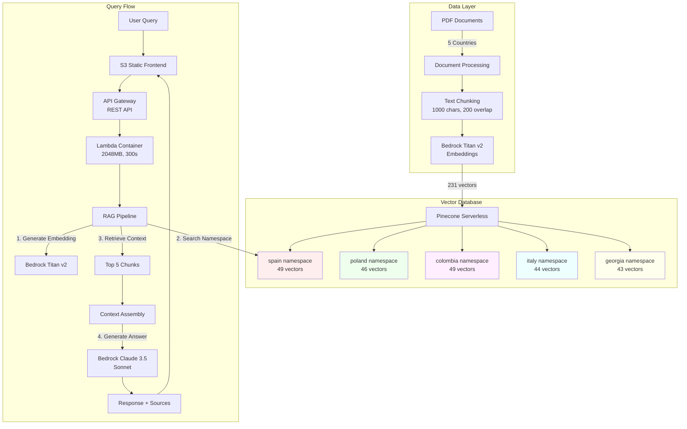

# RAG Powered AI Assistant

[](https://www.python.org/)
[](https://aws.amazon.com/lambda/)
[](https://www.pinecone.io/)
[](LICENSE)

Intelligent employment regulations assistant using RAG (Retrieval-Augmented Generation) architecture with namespace isolation to provide accurate, country-specific answers from a private knowledge base.

## Live Demo

**Frontend:** [https://rag-powered-ai-assistant-frontend.s3.eu-central-1.amazonaws.com/index.html](https://rag-powered-ai-assistant-frontend.s3.eu-central-1.amazonaws.com/index.html)

**API Endpoint:** `https://sycfgthg0g.execute-api.eu-central-1.amazonaws.com/prod/query`

Experience real-time RAG technology with namespace-isolated knowledge retrieval across 5 countries.

---

## Problem Statement

Organizations operating across multiple countries face challenges accessing accurate, jurisdiction-specific employment regulations. Traditional documentation systems:
- Mix information from different countries
- Lack contextual understanding
- Require manual cross-referencing
- Cannot synthesize information from multiple sources

**Result:** Time-consuming research, potential compliance errors, and difficulty accessing accurate country-specific guidance.

---

## Solution

A serverless RAG system with **namespace isolation** that ensures zero cross-contamination between countries:

1. **Select Country** - Choose from 5 supported jurisdictions
2. **Ask Question** - Natural language queries about employment regulations
3. **Get Answer** - Contextual responses with source citations from the correct country
4. **Verify Sources** - Review document references with relevance scores

The system uses **Pinecone namespaces** to guarantee that queries to Spain only retrieve Spanish documents, Poland only Polish documents, etc.

---

## Architecture



### Technical Stack

| Component | Technology | Configuration |
|-----------|-----------|---------------|
| **Frontend** | S3 Static Website | HTML/CSS/JS, HTTPS enabled |
| **API** | API Gateway REST | CORS enabled, regional |
| **Compute** | Lambda Container Image | Python 3.12, 2048MB, 300s timeout |
| **Orchestration** | LangChain | Modular RAG pipeline |
| **Vector DB** | Pinecone Serverless | 1024 dims, cosine similarity, us-east-1 |
| **Embeddings** | Bedrock Titan v2 | amazon.titan-embed-text-v2:0 |
| **LLM** | Bedrock Claude 3.5 Sonnet | anthropic.claude-3-5-sonnet-20240620-v1:0 |
| **Monitoring** | CloudWatch Logs | Lambda execution logs |

---

## Key Features

### Namespace Isolation
**Critical requirement:** Zero cross-contamination between countries.
- Each country has its own Pinecone namespace
- Queries to Spain only search `spain` namespace
- **Test results:** 100% isolation verified across all countries

### Performance
- **Cold start:** 4.75s (Lambda container initialization)
- **Warm start:** 2.92s (subsequent requests)
- **Vector search:** ~300ms (Pinecone serverless)
- **LLM generation:** ~2.1s (Claude 3.5 Sonnet)

### Accuracy
- Top-5 relevant chunks retrieved per query
- Cosine similarity scoring
- Source citations with page numbers and relevance scores
- Context-grounded answers (reduces hallucinations)

### Scalability
- Serverless architecture (auto-scaling)
- 231 vectors across 5 namespaces
- Supports thousands of concurrent queries
- No infrastructure management required

---

## Supported Countries

| Country | Documents | Vector Count | Namespace |
|---------|-----------|--------------|-----------|
| Spain | 3 PDFs | 49 chunks | `spain` |
| Poland | 3 PDFs | 46 chunks | `poland` |
| Colombia | 3 PDFs | 49 chunks | `colombia` |
| Italy | 3 PDFs | 44 chunks | `italy` |
| Georgia | 3 PDFs | 43 chunks | `georgia` |

**Total:** 15 PDF documents, 231 indexed chunks

---

## Project Structure

```
RAG-powered_AI_assistant/
├── rag_core/                       # Modular RAG architecture
│   ├── config/
│   │   └── settings.py            # Centralized configuration
│   ├── interfaces/
│   │   ├── vector_store.py        # Abstract VectorStore
│   │   ├── llm.py                 # Abstract LLM
│   │   └── embeddings.py          # Abstract Embeddings
│   ├── implementations/
│   │   ├── vector_stores/
│   │   │   └── pinecone_store.py  # Pinecone implementation
│   │   ├── llms/
│   │   │   └── bedrock_llm.py     # Bedrock LLM implementation
│   │   └── embeddings/
│   │       └── bedrock_embeddings.py
│   ├── factories/
│   │   ├── vector_store_factory.py
│   │   ├── llm_factory.py
│   │   └── embeddings_factory.py
│   └── core/
│       └── rag_pipeline.py        # Main RAG orchestration
├── lambda_function/
│   ├── app.py                     # Lambda handler
│   ├── Dockerfile                 # Container image
│   └── requirements.txt           # Lambda dependencies
├── scripts/
│   ├── build_index.py             # Index PDFs to Pinecone
│   └── deploy_frontend.sh         # Deploy frontend to S3
├── frontend/
│   └── index.html                 # Web interface
├── data/                          # PDF documents by country
│   ├── spain/
│   ├── poland/
│   ├── colombia/
│   ├── italy/
│   └── georgia/
├── test_results.md                # Comprehensive test report
├── requirements.txt               # Development dependencies
├── .env                           # Environment variables (not in repo)
├── .gitignore
├── LICENSE
└── README.md
```

---

## Installation & Deployment

### Prerequisites

- AWS Account with Bedrock access in `eu-central-1`
- Pinecone account (free tier)
- Python 3.12+
- Docker Desktop (for Lambda container)
- AWS CLI configured

### 1. Clone Repository

```bash
git clone https://github.com/AndresFMC/RAG-powered_AI_assistant.git
cd RAG-powered_AI_assistant
```

### 2. Set Up Python Environment

```bash
python3.12 -m venv venv
source venv/bin/activate  # Windows: venv\Scripts\activate
pip install -r requirements.txt
```

### 3. Configure Environment Variables

Create `.env` file:
```bash
# Pinecone Configuration
PINECONE_API_KEY=your_pinecone_api_key
PINECONE_INDEX_NAME=rag-powered-ai-assistant

# AWS Configuration (auto-detected by Lambda)
AWS_REGION=eu-central-1

# Bedrock Models
BEDROCK_EMBEDDING_MODEL=amazon.titan-embed-text-v2:0
BEDROCK_LLM_MODEL=anthropic.claude-3-5-sonnet-20240620-v1:0

# Component Selection
VECTOR_STORE_TYPE=pinecone
EMBEDDINGS_TYPE=bedrock
LLM_TYPE=bedrock

# RAG Configuration
CHUNK_SIZE=1000
CHUNK_OVERLAP=200
TOP_K_RESULTS=5
```

### 4. Create Pinecone Index

```bash
# Via Pinecone Console:
# - Name: rag-powered-ai-assistant
# - Dimension: 1024 (Titan v2)
# - Metric: cosine
# - Cloud: AWS
# - Region: us-east-1 (free tier)
```

### 5. Index Documents to Pinecone

```bash
# Ensure PDFs are in data/{country}/ directories
python scripts/build_index.py
```

**Output:** 231 vectors indexed across 5 namespaces (~2-3 minutes)

### 6. Build and Deploy Lambda Container

```bash
# Build Docker image (M1 Mac: use --platform linux/amd64)
cd RAG-powered_AI_assistant
docker build --platform linux/amd64 \
  -f lambda_function/Dockerfile \
  -t rag-powered-ai-assistant:latest .

# Authenticate to ECR
aws ecr get-login-password --region eu-central-1 | \
  docker login --username AWS --password-stdin \
  {ACCOUNT_ID}.dkr.ecr.eu-central-1.amazonaws.com

# Tag and push
docker tag rag-powered-ai-assistant:latest \
  {ACCOUNT_ID}.dkr.ecr.eu-central-1.amazonaws.com/rag-powered-ai-assistant:latest
docker push {ACCOUNT_ID}.dkr.ecr.eu-central-1.amazonaws.com/rag-powered-ai-assistant:latest

# Create Lambda function
aws lambda create-function \
  --function-name rag-powered-ai-assistant \
  --package-type Image \
  --code ImageUri={ACCOUNT_ID}.dkr.ecr.eu-central-1.amazonaws.com/rag-powered-ai-assistant:latest \
  --role {LAMBDA_ROLE_ARN} \
  --environment Variables="{PINECONE_API_KEY=...,PINECONE_INDEX_NAME=...}" \
  --timeout 300 \
  --memory-size 2048 \
  --region eu-central-1
```

### 7. Create API Gateway

```bash
# Create REST API and configure resources/methods
# See deployment guide in docs/ for detailed steps
# Final endpoint: https://{api-id}.execute-api.eu-central-1.amazonaws.com/prod/query
```

### 8. Deploy Frontend

```bash
# Update frontend/index.html with your API endpoint
# Deploy to S3
./scripts/deploy_frontend.sh
```

---

## API Usage

### Endpoint
```
POST https://sycfgthg0g.execute-api.eu-central-1.amazonaws.com/prod/query
```

### Request Format

```json
{
  "country": "spain",
  "question": "What is the probation period in Spain?"
}
```

**Supported countries:** `spain`, `poland`, `colombia`, `italy`, `georgia`

### Response Format

```json
{
  "answer": "According to the context provided, the probation period in Spain varies depending on the employee's qualifications:\n\n1. For qualified technicians with a university degree: Up to 6 months.\n2. For all other employees: Up to 2 months...",
  "country": "spain",
  "sources": [
    {
      "file": "02_spain_labor_regulations.pdf",
      "score": 0.5056,
      "page": 2.0
    },
    {
      "file": "01_spain_general_hiring_guide.pdf",
      "score": 0.4298,
      "page": 2.0
    }
  ],
  "chunks_used": 5,
  "model": "anthropic.claude-3-5-sonnet-20240620-v1:0"
}
```

### Example with cURL

```bash
curl -X POST \
  "https://sycfgthg0g.execute-api.eu-central-1.amazonaws.com/prod/query" \
  -H "Content-Type: application/json" \
  -d '{"country":"poland","question":"What are the mandatory vacation days?"}'
```

### Stats Endpoint

```bash
curl -X POST \
  "https://sycfgthg0g.execute-api.eu-central-1.amazonaws.com/prod/query" \
  -H "Content-Type: application/json" \
  -d '{"action":"stats"}'
```

**Response:**
```json
{
  "total_vectors": 231,
  "namespaces": {
    "spain": {"vector_count": 49},
    "poland": {"vector_count": 46},
    "colombia": {"vector_count": 49},
    "italy": {"vector_count": 44},
    "georgia": {"vector_count": 43}
  },
  "countries": ["spain", "poland", "colombia", "italy", "georgia"]
}
```

---

## Testing Results

See [test_results.md](test_results.md) for comprehensive test report.

### Key Findings

**Namespace Isolation:** 100% verified
- Spain queries return only Spanish documents
- Poland queries return only Polish documents
- Zero cross-contamination across all 5 countries

**Performance Metrics:**
- Cold start: 4.75s (within target)
- Warm start: 2.92s (excellent)
- Vector search: ~300ms
- End-to-end: <5s average

**Error Handling:**
- Invalid country: ✓ Proper error message
- Empty question: ✓ Validation works
- Irrelevant questions: ✓ Acknowledges lack of context

---

## Architecture Decisions

### Why Pinecone Serverless?

**Requirement:** Guarantee zero cross-contamination between countries.

**Evaluation:**
- **Graph DB:** Adds complexity without addressing isolation need
- **SQL Database:** Not optimized for vector similarity search
- **Pinecone Namespaces:** Native isolation at infrastructure level

**Decision:** Pinecone with namespace-per-country architecture ensures impossible cross-contamination while maintaining cloud-agnostic design.

### Why Lambda Container Image?

**Challenge:** LangChain + dependencies exceed 250MB Lambda layer limit.

**Solution:** Container image deployment (10GB limit vs 250MB).

**Benefits:**
- Same environment local and deployed
- Reproducible builds
- Easier dependency management

### Why Modular Architecture?

**Design:** 3-layer architecture (Application → Interface → Implementation)

**Benefits:**
- Swap Pinecone for Qdrant: Change 1 config line
- Swap Bedrock for vLLM: Change 1 config line
- Business logic untouched
- Production-ready from day 1

### Why Titan v2 (1024 dims)?

Initial configuration targeted 1536 dimensions based on incomplete information. Testing revealed:
- Titan v2 generates 1024 dimensions (not 1536)
- 1024 dims provides excellent accuracy for this use case
- Smaller vector size = faster search, lower storage

**Lesson:** Always verify technical specifications against official documentation.

---

## Cost Analysis

### Development Costs
- **Pinecone:** Free tier (sufficient for PoC)
- **Bedrock:** Free tier + minimal usage (~$2)
- **Lambda:** Free tier
- **API Gateway:** Free tier
- **S3:** <$0.10/month

**Total PoC cost:** ~$2-3

### Production Estimates (1000 queries/month)

| Component | Cost/Month |
|-----------|------------|
| Pinecone free tier | $0 |
| Bedrock Titan embeddings | ~$0.30 |
| Bedrock Claude 3.5 | ~$2.50 |
| Lambda | ~$0.20 |
| API Gateway | ~$0.10 |
| S3 | ~$0.10 |
| **Total** | **~$3.20** |

**Per query:** ~$0.003

---

## Limitations & Future Enhancements

### Current Limitations
1. **Fixed countries:** 5 hardcoded countries (not dynamic)
2. **No authentication:** API publicly accessible
3. **No rate limiting:** Potential for abuse
4. **No caching:** Every query hits full RAG pipeline
5. **English only:** UI and responses in English

### Planned Enhancements
- API key authentication
- Dynamic country/namespace management
- Response caching (Redis)
- Multi-language support
- Graph DB integration for relationship queries
- Advanced analytics dashboard

---

## Troubleshooting

### Lambda Issues

**Cold start >10s:**
- Check container image size
- Verify Lambda memory (2048MB recommended)
- Review CloudWatch logs for initialization errors

**Import errors:**
```bash
# Verify dependencies match
pip freeze > requirements.txt
# Rebuild container
docker build --no-cache ...
```

### Pinecone Issues

**Connection errors:**
- Verify API key in environment variables
- Check index name matches configuration
- Confirm region is us-east-1 (free tier)

**Dimension mismatch:**
```
Error: Vector dimension 1024 does not match index 1536
```
**Solution:** Recreate index with dimension=1024

### API Gateway Issues

**CORS errors:**
- Verify OPTIONS method configured
- Check CORS headers in Lambda response
- Confirm API deployed to `prod` stage

**404 Not Found:**
- Verify API endpoint URL
- Check resource path: `/query`
- Confirm Lambda integration configured

---

## Development

### Local Testing

```bash
# Test RAG pipeline locally
python test_rag_local.py

# Expected output:
# RAG Pipeline initialized
# Countries: ['spain', 'poland', ...]
# Query test passed
```

### Update Frontend

```bash
# Edit frontend/index.html
# Deploy changes
./scripts/deploy_frontend.sh
```

### Rebuild Index

```bash
# Add new PDFs to data/{country}/
# Reindex
python scripts/build_index.py
```

---

## Contributing

Contributions welcome! Areas for improvement:
- Additional countries/jurisdictions
- Authentication system
- Caching layer
- Multi-language support
- Advanced search filters

Please open an issue before starting major work.

---

## License

MIT License - see [LICENSE](LICENSE) file for details.

---

## Contact

**Andres F.**
- LinkedIn: [linkedin.com/in/andres-fmc](https://www.linkedin.com/in/andres-fmc/)
- GitHub: [github.com/AndresFMC](https://github.com/AndresFMC)

---

**Built with:** AWS Lambda • Amazon Bedrock • Pinecone • LangChain • Python 3.12